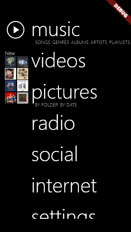

<h1 align="center">Zune ORG Player</h1>

<div style="text-align: center; margin-bottom: 32px;">
	<b>A fun little project to re-create Zune HD music player using Flutter for frontend and Rust for audio backend</b>
</div>
<div style="text-align: center;">
  
  
</div>

## Getting Started

### Mac OS & Windows

This project leverages Flutter for GUI and Rust for the backend logic,
utilizing the capabilities of the
[Rinf](https://pub.dev/packages/rinf) framework.

To run and build this app, you need to have
[Flutter SDK](https://docs.flutter.dev/get-started/install)
and [Rust toolchain](https://www.rust-lang.org/tools/install)
installed on your system.
You can check that your system is ready with the commands below.
Note that all the Flutter subcomponents should be installed.

```bash
rustc --version
flutter doctor
```

Setup Rust:

```bash
// Mac OS
brew install rustup
// Windows
curl --proto '=https' --tlsv1.2 -sSf https://sh.rustup.rs | sh
// Setup
rustup-init
```

Install CLI tool Rust Inside Flutter:

```bash
cargo update
cargo install rinf
```

Messages sent between Dart and Rust are implemented using Protobuf.
If you have newly cloned the project repository
or made changes to the `.proto` files in the `./messages` directory,
run the following command:

```bash
rinf message
```

Add music files in `/zune-org/music_dir`

- Mac OS

  `> flutter run -d macos`

- Windows

  `> flutter run -d windows`
